# three-stacks

**A permutation of length 22 that three stacks in series cannot sort — with a
machine-checkable proof.**

```
6-14-2-10-4-18-7-12-3-20-15-9-5-19-13-22-8-17-11-21-16-1
```

The previous record was 38 (Atkinson, 1992), and it had stood for over thirty
years. No explicit witness had ever been published, at any length — not
Tarjan's claimed 41, not Murphy's 39, not Atkinson's 38. This one comes with
a DRAT certificate that anyone can check with someone else's checker.

It is also a **basis element**: unsortable, but every one of its 22 one-point
deletions *is* sortable, each with an explicit operation word you can replay
by hand. So the shortest permutation three stacks cannot sort has length
somewhere in **[14, 22]** — exactly Waton's guess.

Along the way this refutes **Murphy's conjecture** that t stacks in series
sort everything up to length (t+1)! — which for t = 3 predicts that every
permutation of length ≤ 24 is sortable, and that the answer is 25. The
witness above has length 22, well inside the range the conjecture claims is
entirely sortable. (A separately certified length-24 basis element sits
exactly on the boundary.)

Full numbers, provenance, and caveats: **[results.md](results.md)**.

---

## The problem

Three stacks in series:

```
input ──▶ S1 ──▶ S2 ──▶ S3 ──▶ output
```

Four operations. Every element performs each exactly once, in order:

| op | effect |
|----|--------|
| `r1` | move the next input element onto S1 |
| `r2` | pop S1, push S2 |
| `r3` | pop S2, push S3 |
| `r4` | pop S3, append to output |

A permutation is *3-stack-sortable in series* if some legal sequence of
operations leaves `1,2,3,…` in the output. Every run is exactly `4n`
operations.

One stack sorts exactly the permutations avoiding `231` (Knuth). Two stacks
in series first fail at length 7. For three stacks, **the length of the
shortest permutation that cannot be sorted is open** — attributed to Waton,
and the subject of a beer wager between Elder (who guessed 15) and Waton (who
guessed 22).



*Each bar is one value occupying one stack, over time. Sortability is exactly
the claim that all three lanes can be drawn with no two bars crossing — that
is the encoding, see below.* Interactive version:
[`docs/visualiser.html`](docs/visualiser.html).

## Why it moved now

The bounds predate practical SAT solving, and nothing in the literature had
applied SAT to multi-stack sortability. Two things made it tractable:

**1. Sortability is a non-crossing condition.** Give each value `v` four event
times `t₁[v] < t₂[v] < t₃[v] < t₄[v]`. Then `π` is sortable **iff** those
times can be chosen so that

* `t₁` respects `π` (input order), and
* `t₄` respects value order (output is the identity), and
* for each stack, the occupancy intervals `[tₛ[v], tₛ₊₁[v]]` are pairwise
  **nested or disjoint, never crossing**.

Crossing is forbidden because it is exactly a LIFO violation: `w` pushed on
top of `v` but popped after it. That is the whole encoding — no simulation of
stack contents, just a total order on `4n` events with transitivity clauses.
Proved in [docs/notes.md](docs/notes.md) §3, and validated against brute force
exhaustively for k = 1, 2, 3 at n ≤ 7 before anything was built on it.

**2. Long witnesses are everywhere.** Random permutations of length 40 are
unsortable about a third of the time and decide in seconds. Finding *a*
witness is easy; the work is shrinking it.

**3. Basin hopping does the shrinking.** Greedy deletion stalls on whatever
basis element it happens to reach (33, then 29). But unsortability is closed
*upward*, so inserting points into a witness keeps it a witness — for free,
with no search. Perturb up, descend again on a fresh random path, keep the
best. Accepting *equal-length* results as the new starting point matters as
much as the perturbation: without it the walk keeps re-perturbing one
permutation and never drifts, and the run sat at 24 for over a hundred
iterations before that change went in.

```
random n=40  →  33  →  29  →  28 → 26 → 25 → 24  →  23 → 22
                greedy        basin hopping         + plateau drift
```

## Verify it yourself

```bash
python -m venv .venv && .venv/Scripts/pip install python-sat pytest
python -m pytest                        # 253 tests (3 are slow; -m "not slow" skips them)

# replay a sorting run by hand — no solver involved
python verify.py replay 231 --k 2 --ops 112123233

# re-decide a small case from scratch, independently
python verify.py exhaust 2435761 --k 2

# the headline claim, end to end
python scripts/verify_basis.py --perm 6-14-2-10-4-18-7-12-3-20-15-9-5-19-13-22-8-17-11-21-16-1
python proofcheck.py                    # drat-trim over every UNSAT claim
```

[`verify.py`](verify.py) and [`proofcheck.py`](proofcheck.py) import nothing
from the solver package — a bug shared between checker and solver would be
invisible otherwise.

`proofcheck.py` needs [drat-trim](https://github.com/marijnheule/drat-trim),
which is not bundled. On Windows with MinGW, `getc_unlocked` needs shimming:

```bash
gcc -O2 -Dgetc_unlocked=getc -o tools/drat-trim.exe drat-trim/drat-trim.c
```

## Hunt for something shorter

```bash
python scripts/hunt.py random --n 40 --rounds 10 --workers 8   # find and shrink
python scripts/hunt.py hop --perm <witness> --workers 8        # basin hop
python scripts/certify.py --perm <witness>                     # make artifacts
```

The bound now sits exactly on Waton's guess of 22. Anything below it sides with
Elder; 15 would settle the bet outright.

## Layout

| path | what |
|---|---|
| [`unsortable/simulator.py`](unsortable/simulator.py) | brute-force ground truth, k stacks in series |
| [`unsortable/encoding.py`](unsortable/encoding.py) | the SAT encoding, `full` (auditable) and `reduced` (fast) modes |
| [`unsortable/minimizer.py`](unsortable/minimizer.py) | descent to a basis element, parallel across cores |
| [`unsortable/search.py`](unsortable/search.py) | witness hunting, structured families, basin hopping |
| [`unsortable/counting.py`](unsortable/counting.py) | the search-free counting ceiling |
| [`verify.py`](verify.py) | **independent** replayer and exhaustive checker |
| [`proofcheck.py`](proofcheck.py) | **independent** drat-trim runner |
| [`docs/notes.md`](docs/notes.md) | proofs: the encoding, the prunings, downward closure |
| [`docs/visualiser.html`](docs/visualiser.html) | watch a permutation flow through the stacks |
| [`results.md`](results.md) | every number, with provenance |

## Caveats

* **Upper bound, not an answer.** 22 is a basis element — no *deletion* of it
  is unsortable — but that does not make it the shortest such permutation
  anywhere. The truth is in [14, 22].
* **Not peer reviewed.** Verified is not refereed.
* **The certificate proves the CNF is unsatisfiable**, not that the CNF asks
  the right question. That is what the encoding proof and the exhaustive
  brute-force agreement are for — see
  [results.md § Verification](results.md#verification).
* **Brute force cannot reach n = 22**, so at that size the simulator cannot
  independently re-decide the instance. Stated plainly in results.md rather
  than buried.
* Literature figures are taken from Vatter,
  [arXiv:2602.16355v2](https://arxiv.org/abs/2602.16355) (24 Aug 2026).
